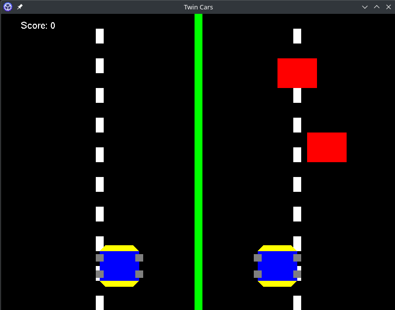
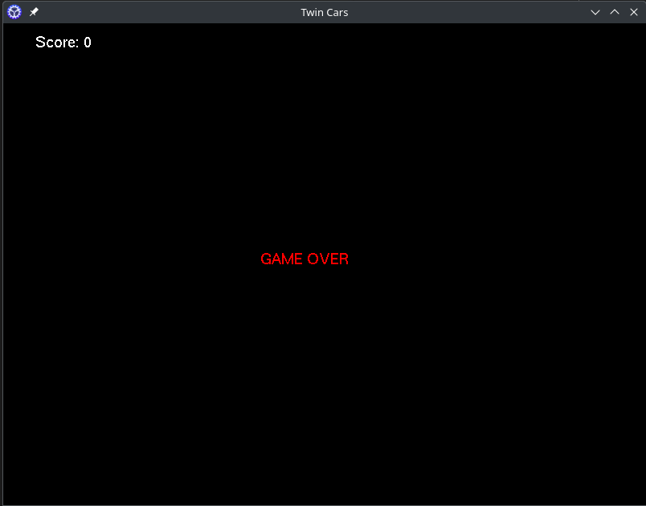

# Twin Cars OpenGL Project


This project is a simple OpenGL application built using C++ that simulates twin cars. It leverages OpenGL, GLU, and GLUT for rendering and window management.

## Requirements

Before building the project, ensure that you have the following dependencies installed:

- `g++` (GNU C++ Compiler)
- OpenGL libraries:
  - `libGL`
  - `libGLU`
  - `libglut`

### Installing Dependencies on Manjaro

You can install the required libraries using the following commands:

For arch based systems

```bash
sudo pacman -Syu
sudo pacman -S freeglut
``` 

## Building the Project
First clone the project using 
```bash
git clone https://github.com/Winstone-Were/twincarsOpenGLGame && cd twincarsOpenGLGame
```

To compile and build the project, you can use the provided `Makefile`. It will generate an executable in the `build` directory.

1. Clone the repository or download the project files.

2. Open a terminal and navigate to the project directory.

3. Run `make` to compile and link the source code:

   ```bash
   make
    ```

## Running the Program
After building the project, you can run the application with:
    ```bash
    make run
    ```

## How to Play the Twin Cars Game

1. **Start the Game**  
   After building and running the project, you can start the game by executing the compiled program (`twin_cars`).

   ```bash
   ./build/twin_cars
    ```

    Or run

    ```bash
    make run
    ```

## Controls

- **Player 1 (Car 1)**: Use the (`A`, `D`) keys to move your car.
- **Player 2 (Car 2)**: Use the (`J`,`L`)  keys to move your car.

Each car has its own controls to navigate through the game environment.

## Objective

- The goal of the game is to navigate both cars and avoid obstacles on the track.
- Try to reach the finish line as quickly as possible without crashing.

## Game Over

- The game ends if either car crashes into an obstacle. You will need to restart the game after a crash.

## Enjoy the Game!

Have fun playing the game and competing with your friend or practicing your driving skills!

---
## Glossary


